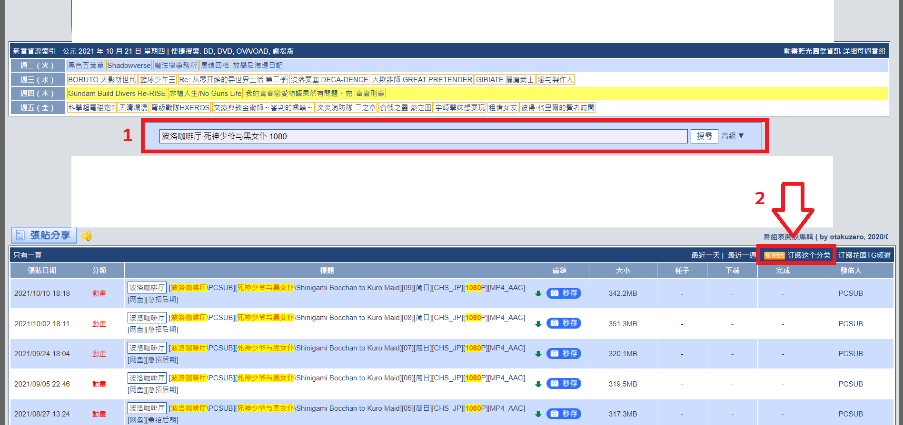
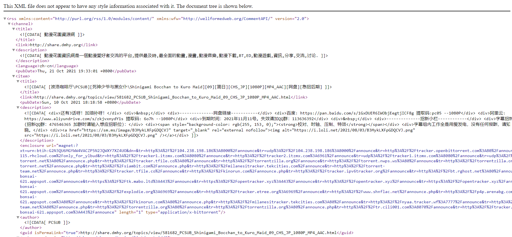

# 如何从动漫花园获取 RSS 链接

* 动漫花园里所有的 RSS 链接都在番剧页面的右上角（图1箭头处）

* 请先在搜索框（图1数字1）搜索要追的番剧
  * 建议使用: 字幕组 + 番剧名 + 其他要求（1080p、简中字幕等）去搜索
* 搜索完后点击（图1数字2）会进入下面这个页面（图2）

* RSS 链接就是这个页面的网址

 
 

# How to get RSS Link from share.dmhy.org

* All RSS link in share.dmhy.org are locate on upper right corner of the search result page (Figure 1 Arrow pointed)

* Please search for the bangumi that you want first, search bar (Figure 1 Number 1)
  * Suggest to search with: Translation Group + Bangumi Name + Other Requirements (1080p, specific subtitle, etc...)
* After search, click on the (Figure 1 Number 2) will enter following page (Figure 2)

* RSS Link is the url of this page 